# Beauty Product Marketplace - Database Schema

## Overview

This document describes the database schema for the Beauty Product Marketplace application. The schema is designed to support all core features including user management, product listings, shopping cart, community features, KYC verification, and advertisements.

## Entity Relationship Diagram

```mermaid
erDiagram
    USER ||--o{ USER_PROFILE : has
    USER ||--o{ USER_KYC : has
    USER ||--o{ PRODUCT : sells
    USER ||--o{ ORDER : places
    COMMUNITY_ROOM ||--o{ COMMUNITY_POST : contains
    COMMUNITY_POST ||--o{ COMMUNITY_MESSAGE : replies
    USER ||--o{ COMMUNITY_POST : creates
    USER ||--o{ COMMUNITY_MESSAGE : sends
    USER ||--o{ CART_ITEM : adds
    USER ||--o{ USER_VERIFICATION : completes
    USER ||--o{ ADVERTISEMENT : creates
    
    PRODUCT ||--o{ ORDER_ITEM : contains
    PRODUCT ||--o{ CART_ITEM : added_to
    PRODUCT ||--o{ PRODUCT_IMAGE : has
    CATEGORY ||--o{ PRODUCT_CATEGORY : contains
    PRODUCT ||--o{ PRODUCT_REVIEW : receives
    
    ORDER ||--o{ ORDER_ITEM : contains
    ORDER ||--o{ ORDER_STATUS : tracks
    ORDER ||--o{ PAYMENT : has
    
    ADVERTISEMENT ||--o{ ADVERTISEMENT_SLOT : placed_in
    
    USER {
        int id PK
        string username
        string email
        string phone
        string password
        datetime created_at
        datetime updated_at
        boolean is_active
        string user_type "buyer|seller|admin"
    }
    
    USER_PROFILE {
        int id PK
        int user_id FK
        string avatar_url
        string bio
        string display_name
        date date_of_birth
        datetime created_at
        datetime updated_at
    }
    
    USER_KYC {
        int id PK
        int user_id FK
        string id_document_url
        string selfie_url
        string status "pending|verified|rejected"
        string rejection_reason
        datetime submitted_at
        datetime reviewed_at
        datetime created_at
        datetime updated_at
    }
    
    USER_VERIFICATION {
        int id PK
        int user_id FK
        boolean age_verified
        datetime age_verified_at
        string verification_token
        datetime token_expires_at
        datetime created_at
    }
    
    CATEGORY {
        int id PK
        string name
        string description
        boolean is_active
        datetime created_at
    }
    
    PRODUCT {
        int id PK
        int seller_id FK
        int category_id FK
        string name
        text description
        decimal price
        int quantity
        boolean is_active
        datetime created_at
        datetime updated_at
    }
    
    PRODUCT_IMAGE {
        int id PK
        int product_id FK
        string image_url
        boolean is_primary
        int sort_order
        datetime created_at
    }
    
    PRODUCT_CATEGORY {
        int id PK
        int product_id FK
        int category_id FK
        datetime created_at
    }
    
    PRODUCT_REVIEW {
        int id PK
        int product_id FK
        int user_id FK
        int rating
        text comment
        datetime created_at
        datetime updated_at
    }
    
    CART_ITEM {
        int id PK
        int user_id FK
        int product_id FK
        int quantity
        datetime created_at
        datetime updated_at
    }
    
    ORDER {
        int id PK
        int user_id FK
        string order_number
        decimal total_amount
        text delivery_address
        string status "pending|processing|shipped|delivered|cancelled"
        datetime created_at
        datetime updated_at
    }
    
    ORDER_ITEM {
        int id PK
        int order_id FK
        int product_id FK
        int quantity
        decimal unit_price
        decimal total_price
        datetime created_at
    }
    
    ORDER_STATUS {
        int id PK
        int order_id FK
        string status "pending|processing|shipped|delivered|cancelled"
        text notes
        datetime created_at
    }
    
    PAYMENT {
        int id PK
        int order_id FK
        string payment_method
        string transaction_id
        decimal amount
        string status "pending|completed|failed|refunded"
        datetime created_at
        datetime updated_at
    }
    
    COMMUNITY_ROOM {
        int id PK
        string name
        text description
        boolean is_private
        boolean is_adult_content
        int created_by FK
        datetime created_at
        datetime updated_at
    }
    
    COMMUNITY_POST {
        int id PK
        int room_id FK
        int user_id FK
        string title
        text content
        boolean has_media
        string media_url
        int likes_count
        int comments_count
        datetime created_at
        datetime updated_at
    }
    
    COMMUNITY_MESSAGE {
        int id PK
        int post_id FK
        int user_id FK
        int parent_message_id FK
        text content
        boolean has_media
        string media_url
        datetime created_at
        datetime updated_at
    }
    
    ADVERTISEMENT {
        int id PK
        string title
        text description
        string image_url
        string target_url
        string status "draft|active|paused|expired"
        date start_date
        date end_date
        decimal budget
        decimal spent
        int created_by FK
        datetime created_at
        datetime updated_at
    }
    
    ADVERTISEMENT_SLOT {
        int id PK
        int advertisement_id FK
        string slot_name
        string page_location
        string dimensions
        decimal price_per_impression
        decimal price_per_click
        datetime created_at
    }
```

## Detailed Table Descriptions

### 1. User Management Tables

#### USERS Table
Stores basic user information and authentication details.

| Column | Type | Description |
|--------|------|-------------|
| id | Integer (PK) | Unique identifier for the user |
| username | String (50) | Unique username for login |
| email | String (100) | User's email address |
| phone | String (20) | User's phone number |
| password | String (128) | Hashed password |
| created_at | DateTime | Timestamp when user was created |
| updated_at | DateTime | Timestamp when user was last updated |
| is_active | Boolean | Whether the user account is active |
| user_type | String | Type of user: buyer, seller, admin |

#### USER_PROFILES Table
Stores additional user profile information including avatar.

| Column | Type | Description |
|--------|------|-------------|
| id | Integer (PK) | Unique identifier for the profile |
| user_id | Integer (FK) | Reference to USERS table |
| avatar_url | String (255) | URL to user's avatar image |
| bio | Text | User's biography |
| display_name | String (100) | Name to display publicly |
| date_of_birth | Date | User's date of birth |
| created_at | DateTime | Timestamp when profile was created |
| updated_at | DateTime | Timestamp when profile was last updated |

#### USER_KYC Table
Stores KYC verification documents and status.

| Column | Type | Description |
|--------|------|-------------|
| id | Integer (PK) | Unique identifier for KYC record |
| user_id | Integer (FK) | Reference to USERS table |
| id_document_url | String (255) | URL to uploaded ID document |
| selfie_url | String (255) | URL to selfie image |
| status | String | Verification status: pending, verified, rejected |
| rejection_reason | Text | Reason for rejection if applicable |
| submitted_at | DateTime | Timestamp when KYC was submitted |
| reviewed_at | DateTime | Timestamp when KYC was reviewed |
| created_at | DateTime | Timestamp when record was created |
| updated_at | DateTime | Timestamp when record was last updated |

#### USER_VERIFICATION Table
Stores age verification and other verification tokens.

| Column | Type | Description |
|--------|------|-------------|
| id | Integer (PK) | Unique identifier for verification |
| user_id | Integer (FK) | Reference to USERS table |
| age_verified | Boolean | Whether user's age has been verified |
| age_verified_at | DateTime | Timestamp when age was verified |
| verification_token | String (100) | Token for email/phone verification |
| token_expires_at | DateTime | When verification token expires |
| created_at | DateTime | Timestamp when record was created |

### 2. Product Management Tables

#### CATEGORIES Table
Stores product categories.

| Column | Type | Description |
|--------|------|-------------|
| id | Integer (PK) | Unique identifier for category |
| name | String (100) | Category name |
| description | Text | Category description |
| is_active | Boolean | Whether category is active |
| created_at | DateTime | Timestamp when category was created |

#### PRODUCTS Table
Stores product information.

| Column | Type | Description |
|--------|------|-------------|
| id | Integer (PK) | Unique identifier for product |
| seller_id | Integer (FK) | Reference to USERS table (seller) |
| category_id | Integer (FK) | Reference to CATEGORIES table |
| name | String (200) | Product name |
| description | Text | Product description |
| price | Decimal (10,2) | Product price |
| quantity | Integer | Available quantity |
| is_active | Boolean | Whether product is active for sale |
| created_at | DateTime | Timestamp when product was created |
| updated_at | DateTime | Timestamp when product was last updated |

#### PRODUCT_IMAGES Table
Stores product images.

| Column | Type | Description |
|--------|------|-------------|
| id | Integer (PK) | Unique identifier for image |
| product_id | Integer (FK) | Reference to PRODUCTS table |
| image_url | String (255) | URL to product image |
| is_primary | Boolean | Whether this is the primary image |
| sort_order | Integer | Order to display images |
| created_at | DateTime | Timestamp when image was created |

#### PRODUCT_CATEGORIES Table
Junction table for products with multiple categories.

| Column | Type | Description |
|--------|------|-------------|
| id | Integer (PK) | Unique identifier |
| product_id | Integer (FK) | Reference to PRODUCTS table |
| category_id | Integer (FK) | Reference to CATEGORIES table |
| created_at | DateTime | Timestamp when association was created |

#### PRODUCT_REVIEWS Table
Stores product reviews from buyers.

| Column | Type | Description |
|--------|------|-------------|
| id | Integer (PK) | Unique identifier for review |
| product_id | Integer (FK) | Reference to PRODUCTS table |
| user_id | Integer (FK) | Reference to USERS table (buyer) |
| rating | Integer | Rating from 1-5 |
| comment | Text | Review comment |
| created_at | DateTime | Timestamp when review was created |
| updated_at | DateTime | Timestamp when review was last updated |

### 3. Shopping and Order Management Tables

#### CART_ITEMS Table
Stores items in user's shopping cart.

| Column | Type | Description |
|--------|------|-------------|
| id | Integer (PK) | Unique identifier for cart item |
| user_id | Integer (FK) | Reference to USERS table |
| product_id | Integer (FK) | Reference to PRODUCTS table |
| quantity | Integer | Quantity of product in cart |
| created_at | DateTime | Timestamp when item was added |
| updated_at | DateTime | Timestamp when item was last updated |

#### ORDERS Table
Stores order information.

| Column | Type | Description |
|--------|------|-------------|
| id | Integer (PK) | Unique identifier for order |
| user_id | Integer (FK) | Reference to USERS table (buyer) |
| order_number | String (50) | Unique order number |
| total_amount | Decimal (10,2) | Total order amount |
| delivery_address | Text | Delivery address |
| status | String | Order status: pending, processing, shipped, delivered, cancelled |
| created_at | DateTime | Timestamp when order was created |
| updated_at | DateTime | Timestamp when order was last updated |

#### ORDER_ITEMS Table
Stores individual items within an order.

| Column | Type | Description |
|--------|------|-------------|
| id | Integer (PK) | Unique identifier for order item |
| order_id | Integer (FK) | Reference to ORDERS table |
| product_id | Integer (FK) | Reference to PRODUCTS table |
| quantity | Integer | Quantity ordered |
| unit_price | Decimal (10,2) | Price per unit at time of order |
| total_price | Decimal (10,2) | Total price for this item |
| created_at | DateTime | Timestamp when order item was created |

#### ORDER_STATUS Table
Tracks order status changes.

| Column | Type | Description |
|--------|------|-------------|
| id | Integer (PK) | Unique identifier for status record |
| order_id | Integer (FK) | Reference to ORDERS table |
| status | String | Order status: pending, processing, shipped, delivered, cancelled |
| notes | Text | Additional notes about status change |
| created_at | DateTime | Timestamp when status was recorded |

#### PAYMENTS Table
Stores payment information.

| Column | Type | Description |
|--------|------|-------------|
| id | Integer (PK) | Unique identifier for payment |
| order_id | Integer (FK) | Reference to ORDERS table |
| payment_method | String (50) | Payment method used |
| transaction_id | String (100) | Transaction ID from payment gateway |
| amount | Decimal (10,2) | Payment amount |
| status | String | Payment status: pending, completed, failed, refunded |
| created_at | DateTime | Timestamp when payment was created |
| updated_at | DateTime | Timestamp when payment was last updated |

### 4. Community Tables

#### COMMUNITY_ROOMS Table
Stores community chat rooms.

| Column | Type | Description |
|--------|------|-------------|
| id | Integer (PK) | Unique identifier for room |
| name | String (100) | Room name |
| description | Text | Room description |
| is_private | Boolean | Whether room is private |
| is_adult_content | Boolean | Whether room contains adult content |
| created_by | Integer (FK) | Reference to USERS table (creator) |
| created_at | DateTime | Timestamp when room was created |
| updated_at | DateTime | Timestamp when room was last updated |

#### COMMUNITY_POSTS Table
Stores community posts.

| Column | Type | Description |
|--------|------|-------------|
| id | Integer (PK) | Unique identifier for post |
| room_id | Integer (FK) | Reference to COMMUNITY_ROOMS table |
| user_id | Integer (FK) | Reference to USERS table (author) |
| title | String (200) | Post title |
| content | Text | Post content |
| has_media | Boolean | Whether post contains media |
| media_url | String (255) | URL to media if applicable |
| likes_count | Integer | Number of likes |
| comments_count | Integer | Number of comments |
| created_at | DateTime | Timestamp when post was created |
| updated_at | DateTime | Timestamp when post was last updated |

#### COMMUNITY_MESSAGES Table
Stores messages within community posts.

| Column | Type | Description |
|--------|------|-------------|
| id | Integer (PK) | Unique identifier for message |
| post_id | Integer (FK) | Reference to COMMUNITY_POSTS table |
| user_id | Integer (FK) | Reference to USERS table (author) |
| parent_message_id | Integer (FK) | Reference to self for replies |
| content | Text | Message content |
| has_media | Boolean | Whether message contains media |
| media_url | String (255) | URL to media if applicable |
| created_at | DateTime | Timestamp when message was created |
| updated_at | DateTime | Timestamp when message was last updated |

### 5. Advertisement Tables

#### ADVERTISEMENTS Table
Stores advertisement information.

| Column | Type | Description |
|--------|------|-------------|
| id | Integer (PK) | Unique identifier for advertisement |
| title | String (200) | Advertisement title |
| description | Text | Advertisement description |
| image_url | String (255) | URL to advertisement image |
| target_url | String (255) | URL where ad should redirect |
| status | String | Ad status: draft, active, paused, expired |
| start_date | Date | When advertisement should start |
| end_date | Date | When advertisement should end |
| budget | Decimal (10,2) | Advertisement budget |
| spent | Decimal (10,2) | Amount spent so far |
| created_by | Integer (FK) | Reference to USERS table (creator) |
| created_at | DateTime | Timestamp when ad was created |
| updated_at | DateTime | Timestamp when ad was last updated |

#### ADVERTISEMENT_SLOTS Table
Stores advertisement placement slots.

| Column | Type | Description |
|--------|------|-------------|
| id | Integer (PK) | Unique identifier for slot |
| advertisement_id | Integer (FK) | Reference to ADVERTISEMENTS table |
| slot_name | String (100) | Name of advertisement slot |
| page_location | String (100) | Where on page slot appears |
| dimensions | String (50) | Dimensions of advertisement slot |
| price_per_impression | Decimal (10,4) | Price per impression |
| price_per_click | Decimal (10,4) | Price per click |
| created_at | DateTime | Timestamp when slot was created |
