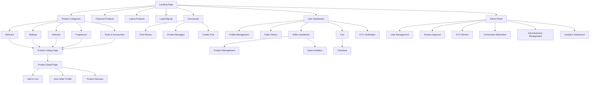

# Beauty Product Marketplace - Frontend Structure

## Overview

This document describes the frontend structure for the Beauty Product Marketplace application. The frontend is built using Django templates with HTML, CSS, and JavaScript, with a focus on responsive design and user experience.

## Site Map

## Key Pages and Components

### 1. Landing Page
- Hero section with featured products
- Category navigation menu
- Search bar
- Login/Signup buttons
- Latest products carousel
- Advertisement slots
- Footer with links and information

### 2. User Authentication Pages
#### Login Page
- Email/phone input
- Password input
- "Forgot Password" link
- Social login buttons
- Signup link

#### Signup Page
- Username input
- Email input
- Phone input
- Password input
- Password confirmation
- Terms and conditions checkbox
- Signup button
- Login link

### 3. KYC Verification Flow
#### KYC Introduction Page
- Explanation of KYC process
- Benefits of verification
- Start verification button

#### Document Upload Page
- ID document upload area
- Selfie capture/upload area
- Document requirements information
- Submit button

#### Verification Status Page
- Current verification status
- Submitted documents preview
- Estimated review time
- Contact support option

### 4. User Dashboard
#### Profile Management
- Avatar upload/selection
- Display name editing
- Bio editing
- Email/phone editing
- Password change
- Delete account option

#### Order History
- List of past orders
- Order status indicators
- Reorder buttons
- Review submission options

#### Seller Dashboard
- Product listing management
- Add new product form
- Sales analytics charts
- Inventory management

### 5. Product Pages
#### Category Listing Page
- Filter options (price, rating, brand)
- Sort options (price, popularity, newness)
- Product grid with images
- Pagination controls

#### Product Detail Page
- Image gallery
- Product title and description
- Price display
- Quantity selector
- "Add to Cart" button
- Seller avatar and rating
- Product reviews section
- Related products carousel

### 6. Shopping Cart & Checkout
#### Cart Page
- List of items with thumbnails
- Quantity adjustment controls
- Remove item buttons
- Price calculations (subtotal, tax, shipping)
- Promo code input
- Proceed to checkout button

#### Checkout Flow
1. Delivery Address Form
   - Address inputs (street, city, state, zip)
   - Save address checkbox
   - Continue button

2. Payment Method Selection
   - Credit card form
   - Payment gateway options (Paystack, Flutterwave, Stripe)
   - Billing address (if different)
   - Continue button

3. Order Review
   - Order summary
   - Delivery address confirmation
   - Payment method confirmation
   - Place order button

4. Order Confirmation
   - Order number
   - Estimated delivery date
   - Order details summary
   - Continue shopping button

### 7. Community Section
#### Community Homepage
- Room categories (General, Skincare, Makeup, etc.)
- Adult content warning and age verification
- Trending posts
- Create post button

#### Chat Room Page
- Room information header
- Message list with timestamps
- Message input area with media attachment
- Online user indicators
- Room settings button

#### Private Messages
- Conversation list sidebar
- Message thread display
- Message input area
- Media attachment options

### 8. Admin Panel
#### Dashboard
- Quick stats overview
- Recent activity feed
- Navigation menu to all sections

#### User Management
- User list with search and filters
- User detail view
- Account status controls (activate/suspend)
- KYC verification review interface

#### Product Approval
- Pending product list
- Product detail review view
- Approval/rejection actions
- Feedback input for rejections

#### Community Moderation
- Reported posts/messages list
- Content review interface
- User banning controls
- Room management

#### Advertisement Management
- Ad creation form
- Ad placement slots management
- Ad performance analytics
- Budget and scheduling controls

## UI Component Library

### Core Components
1. **Navigation Bar**
   - Logo
   - Category menu
   - Search bar
   - User menu (avatar, notifications)
   - Cart icon with badge

2. **Product Card**
   - Product image
   - Title and price
   - Rating display
   - "Add to Cart" button

3. **Avatar Component**
   - Circular avatar image
   - Status indicator
   - Clickable for profile view

4. **Review Component**
   - Star rating display
   - User avatar
   - Review text
   - Date stamp

5. **Chat Message Component**
   - User avatar
   - Message text
   - Timestamp
   - Media attachments

### Form Components
1. **Input Field**
   - Label
   - Text input
   - Validation messages
   - Help text

2. **File Upload**
   - Drag and drop area
   - File selection button
   - Preview of selected files
   - File type and size validation

3. **Image Gallery**
   - Main image display
   - Thumbnail navigation
   - Lightbox view option

### Layout Components
1. **Grid System**
   - Responsive columns
   - Gutters and spacing
   - Breakpoints for mobile/desktop

2. **Modal Dialog**
   - Overlay background
   - Content container
   - Close button
   - Action buttons

3. **Notification Toast**
   - Message display
   - Icon indicator
   - Auto-dismiss timer
   - Action buttons

## Responsive Design Considerations

### Breakpoints
- Mobile: 0px - 768px
- Tablet: 769px - 1024px
- Desktop: 1025px+

### Mobile-First Approach
1. **Navigation**
   - Hamburger menu for mobile
   - Bottom navigation bar for key actions
   - Collapsible filters

2. **Product Display**
   - Single column product grid on mobile
   - Horizontal scrolling for related products
   - Sticky "Add to Cart" button

3. **Forms**
   - Full-width input fields
   - Large touch targets
   - Simplified form steps

4. **Community Features**
   - Swipeable chat rooms
   - Voice message option
   - Simplified media upload

## Accessibility Features

1. **Keyboard Navigation**
   - Tab order through all interactive elements
   - Skip to content link
   - Keyboard shortcuts for power users

2. **Screen Reader Support**
   - Proper heading hierarchy
   - Alt text for all images
   - ARIA labels for interactive elements

3. **Color Contrast**
   - WCAG AA compliance
   - Dark mode option
   - Custom color theme options

4. **Text Scaling**
   - Support for browser text scaling
   - Custom font size controls

## Required Frontend Libraries and Frameworks

### Core Framework
- Django Templates for server-side rendering
- HTML5, CSS3, JavaScript (ES6+)

### UI Components
- Bootstrap 5 for responsive grid and components
- Custom CSS for branding and styling

### JavaScript Libraries
- Axios for API requests
- Chart.js for analytics visualization
- Moment.js for date/time handling

### Form Handling
- Django's built-in form handling
- Custom validation scripts

### Community Features
- WebSocket library for real-time chat
- Media upload handling

### Security
- CSRF protection (built into Django)
- Content Security Policy implementation
